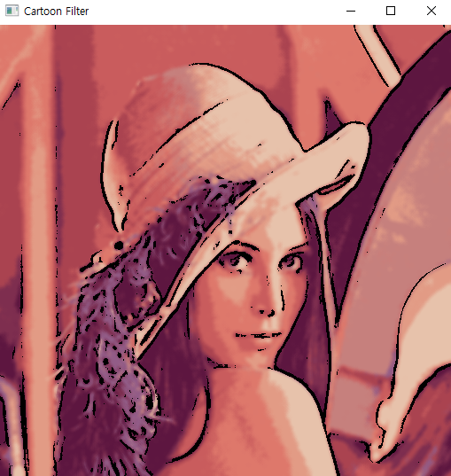

# cartoon_filter
이 필터는 edge_mask 함수를 정의하여 엣지 검출을 수행하여 엣지 마스크를 생성하였습니다. 
입력이미지를 그레이 스케일로 변환하고 블러링을 해준다음 cv2.adaptiveThreshold의 
적응형 임계값을 사용하여 엣지를 검출하였습니다. 
그 다음 color_quantization 함수를 정의하여 색상양자화를 통해 이미지의 색상을 간단화였습니다.
cv2.kmeans을 사용하여 색상을 클러스터링하고 양자화된 이미지와 엣지마스크를 사용하여
카툰 필터 효과를 생성하였으며 이 필터는 만화책 느낌의 효과를 줍니다.

## 변경전

## 변경후
